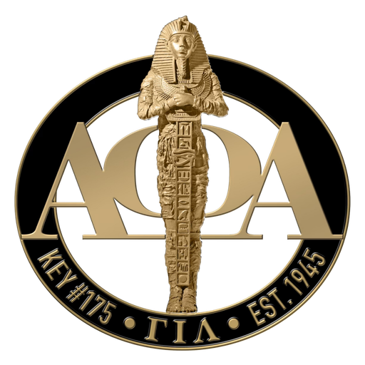

# Gamma Iota Lambda Chapter — Official Website
**The Brooklyn Alphas · Alpha Phi Alpha Fraternity, Inc.**
Live site: [www.gil1906.org](https://www.gil1906.org)

---

## Overview

This is the official website for Gamma Iota Lambda Chapter of Alpha Phi Alpha Fraternity, Inc., chartered May 5, 1945 in Brooklyn, NY. The site is a static HTML/CSS/JS website — no build tools, no frameworks, no dependencies. Every page is a plain `.html` file that links to a shared `style.css`.

---

## Site Structure

```
/
├── index.html                  # Homepage (hero, about, programs, history, meetings, contact)
├── alpha-academy.html          # Alpha Academy program page
├── chapter-history.html        # Full chapter history
├── executive-board.html        # 2025–2026 Executive Board
├── fraternity-history.html     # Alpha Phi Alpha fraternity history
├── impact-20.html              # Impact $20 donation campaign
├── recommended-readings.html   # Curated reading list
├── scholarship.html            # Judge Myles A. Paige Scholarship
├── 404.html                    # Custom not-found page
├── style.css                   # All shared styles (single stylesheet)
├── sitemap.xml                 # XML sitemap for Google indexing
├── robots.txt                  # Search crawler instructions
├── _redirects                  # URL redirects (Netlify/Cloudflare Pages)
├── favicon.png                 # Browser tab icon (32×32px)
├── apple-touch-icon.png        # iOS home screen icon (180×180px)
├── og-image.jpg                # Social sharing preview image (1200×630px)
├── gil-crest.png               # Chapter crest — used in nav and as headshot placeholder
├── zelle-qr.png                # Zelle QR code (Impact $20 page)
├── chapter-photo1.png          # Chapter group photo
└── headshots/
    ├── robert-brissett.jpeg
    ├── lucien-allen.jpg
    ├── david-williams.jpg
    ├── sherron-cloyd.jpg
    ├── dwane-omar-jones.jpg
    ├── andre-mckenzie.jpg
    ├── eugene-aiken.jpg
    ├── jessy-dwyer.jpg
    ├── david-brown.jpg
    ├── eric-davis.jpeg
    ├── farid-adenuga.jpg
    └── bryce-tarrant.jpeg
```

---

## Making Updates

### Editing content
All content is written directly in the HTML files. There is no CMS. Open the relevant `.html` file in any text editor, make your changes, and push to the repo.

### Shared styles
All visual styling lives in `style.css`. Page-specific styles are written in `<style>` blocks inside each HTML file's `<head>`. If a style change should affect every page (nav, footer, buttons, typography), edit `style.css`. If it's specific to one page, edit that page's `<style>` block.

### Adding a new page
1. Copy the structure of an existing inner page (e.g. `chapter-history.html`)
2. Update the `<title>`, `<meta name="description">`, and `<link rel="canonical">` tags
3. Update the Open Graph and Twitter Card meta tags
4. Add a `<url>` entry to `sitemap.xml`
5. Add a link to it in the nav dropdown on every page (both desktop `nav-links` and mobile `nav-mobile-menu`)

---

## Third-Party Services

### Google Analytics
- **Property:** Gamma Iota Lambda Chapter
- **Measurement ID:** `G-4YESGMG3TC`
- The tracking snippet is in the `<head>` of every page
- To view data: [analytics.google.com](https://analytics.google.com)

### Formspree (Contact Form)
- The contact form on `index.html` submits to Formspree
- **Form action URL:** `https://formspree.io/f/YOUR_FORM_ID`
- Replace `YOUR_FORM_ID` with the actual ID from your Formspree dashboard
- To manage submissions, set notification email, or change the form: [formspree.io](https://formspree.io)
- The form field names (`name`, `email`, `subject`, `message`) map directly to what Formspree displays in its dashboard

### Google Search Console
- Sitemap submitted at: `https://www.gil1906.org/sitemap.xml`
- To verify ownership or check indexing status: [search.google.com/search-console](https://search.google.com/search-console)

### Substack (Newsletter embed)
- Embedded on `index.html` via iframe
- Publication: [gil1906.substack.com](https://gil1906.substack.com)
- To manage subscribers and posts: [substack.com](https://substack.com)

---

## Headshots

Headshots live in the `headshots/` folder. File naming convention is `firstname-lastname.jpg` (lowercase, hyphenated). Some files use `.jpeg` instead of `.jpg` — preserve the extension exactly as it exists when adding new photos.

**Current status:**
| Member | File | Status |
|---|---|---|
| Robert Brissett | `robert-brissett.jpeg` | ✓ |
| Lucien Allen | `lucien-allen.jpg` | ✓ |
| David Williams | `david-williams.jpg` | ✓ |
| Sherron Cloyd | `sherron-cloyd.jpg` | ✓ |
| Dwane Omar Jones | `dwane-omar-jones.jpg` | ✓ |
| Andre McKenzie | `andre-mckenzie.jpg` | ✓ |
| Eugene Aiken | `eugene-aiken.jpg` | ✓ |
| Jessy Dwyer | `jessy-dwyer.jpg` | ✓ |
| David Brown | `david-brown.jpg` | ✓ |
| Eric Davis | `eric-davis.jpeg` | ✓ |
| Farid Adenuga | `farid-adenuga.jpg` | ✓ |
| Bryce Tarrant | `bryce-tarrant.jpeg` | ✓ |
| Daniel Williams | — | ⚠ No photo — shows crest placeholder |

**To add a new headshot:**
1. Crop to a square (1:1 ratio), ideally at least 400×400px
2. Name the file `firstname-lastname.jpg`
3. Compress it at [squoosh.app](https://squoosh.app) before adding (target under 100KB)
4. Drop it in `headshots/`
5. Update `executive-board.html` — find the card, remove the `placeholder` class from `.eb-card-img-wrap`, update the `src` and `alt` attributes

---

## Updating the Executive Board

Each board term, update `executive-board.html`:

1. Update the hero subtitle: `2025–2026 · Servants of All` → new term
2. Update the `<title>` and meta description year
3. Update the JSON-LD structured data block (`<script type="application/ld+json">`) with the new member list
4. Update `sitemap.xml` — change the `<lastmod>` date for `executive-board.html`

For each member card, the pattern is:
```html
<div class="eb-card reveal">
  <div class="eb-card-img-wrap">
    
  </div>
  <div class="eb-card-name">Full Name</div>
  <div class="eb-card-role">Role Title</div>
</div>
```

For a member with no photo, add the `placeholder` class and use `gil-crest.png`:
```html
<div class="eb-card-img-wrap placeholder">
  
</div>
```

---

## Updating the Scholarship Page

Each year, update `scholarship.html`:

1. Update the year references (`2025` → new year) in the `<title>`, meta description, hero heading, and body text
2. Update the application deadline date in both the body copy and the sidebar card
3. Update the JSON-LD `applicationDeadline` field (ISO format: `YYYY-MM-DD`)
4. Update the essay prompt if it changes
5. Update the application link `href` if the Google Form URL changes

---

## SEO Notes

Every page has:
- A unique `<title>` and `<meta name="description">`
- A `<link rel="canonical">` pointing to `https://www.gil1906.org/PAGE.html`
- Open Graph tags (`og:title`, `og:description`, `og:image`, `og:url`)
- Twitter Card tags
- JSON-LD structured data appropriate to the page type

The canonical domain is `https://www.gil1906.org` (non-www, HTTPS). The host should be configured to:
- Force HTTPS on all requests
- Redirect `www.gil1906.org` → `gil1906.org` (or vice versa — pick one and be consistent)
- Redirect old GitHub Pages paths (`/brooklyn-alphas/*`) to the new canonical paths — these are defined in `_redirects`

---

## Deployment

The site is static and can be hosted anywhere that serves HTML files. The `_redirects` file is formatted for **Netlify** and **Cloudflare Pages**. If hosting on a different platform:

- **Apache:** Convert `_redirects` rules to `.htaccess` `Redirect` or `RewriteRule` directives
- **Nginx:** Add `return 301` rules to the server block
- **GitHub Pages:** Use a `404.html` fallback (already present) — note that GitHub Pages does not support server-side redirects natively

To deploy: push changes to the connected branch. The site updates automatically if CI/CD is configured.

---

## Browser & Accessibility

- Tested in Chrome, Firefox, Safari, and mobile (iOS Safari, Android Chrome)
- Skip-to-content link on every page for keyboard navigation
- ARIA labels on nav, mobile menu dialog, and interactive elements
- `prefers-reduced-motion` respected via CSS (animations disabled for users who opt out)
- Color contrast meets WCAG AA for primary text

---

## Contacts

| Role | Contact |
|---|---|
| General inquiries | info@gil1906.org |
| Membership | membership@gil1906.org |
| Alpha Academy | education@gil1906.org |
| Scholarship | education@gil1906.org (subject: GIL Scholarship 2025) |

---

*Gamma Iota Lambda Chapter · Alpha Phi Alpha Fraternity, Inc. · Chartered May 5, 1945 · Brooklyn, New York*
